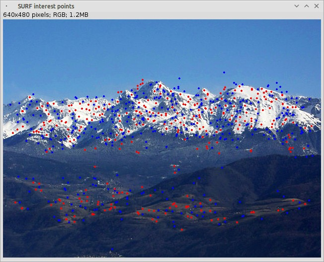

# SURF algorithm for ImageJ

SURF algorithm created by Eugen Labun, packaged to be available with Maven.    
All under GNU GPL license, thanks a lot !

This algorithm is written in pure Java, so it can be used everywhere there is a Java Virtual Machine (tested with OpenJDK) 
 
See: http://labun.com/imagej-surf/

## What is this ?

SURF (Speeded up robust features) is a computer vision algorithm that allow to detect interesting points on an image.

It can be used to detect objects on pictures, or to stitch images between them.

SURF algorithm have been slightly modified and packaged to be available with Maven.

## Screenshot

Example with this picture:

## How does it work ?

You need to install Git and Maven, then to create a new project. On Ubuntu GNU/Linux:

       $ cd /tmp
       $ sudo apt-get install git maven
       $ mvn archetype:generate -DgroupId=com.mycompany.app -DartifactId=my-app \
            -DarchetypeArtifactId=maven-archetype-quickstart -DinteractiveMode=false

After clone this project and install it:
 
       $ git clone https://github.com/remipassmoilesel/imagej-surf
       $ cd imagej-surf
       $ mvn install
       
Then in your project, paste these lines in "pom.xml":

       <dependency>
           <groupId>com.labun</groupId>
           <artifactId>surf</artifactId>
           <version>1.0</version>
       </dependency>
      
Then update your project:

       $ mvn compile
       
After, you can use SURF algorithm like this:

        public static void main(){
        
            // get the image to analyze
            final ImagePlus imp = getImagePlus();
            IntegralImage intImg = new IntegralImage(imp.getProcessor(), true);

            if (imp == null) {
                throw new NullPointerException("Unable to find image !");
            }
            
            // configure algorithm
            final Params surfParams = new Params(4, 4, 0.0001f, 2, false, false, false, 1, false);
            
            // search points
            final List<InterestPoint> points = IJFacade.detectAndDescribeInterestPoints(intImg, surfParams);
            
            // display image with points
            IJFacade.drawInterestPoints(imp.getProcessor(), points, surfParams);
            ImagePlus imp2 = new ImagePlus("SURF interest points", imp.getProcessor());
            imp2.show();
            
            Thread.sleep(20000);

        }
        
        private ImagePlus getImagePlus() throws IOException {
        
           // get buffered image
           BufferedImage bimg = ImageIO.read(SimpleTest.class.getResourceAsStream("/belledonne.jpg"));
           ImagePlus imp = new ImagePlus("", bimg);
        
           // convert it if necessary
           if (imp.getProcessor().getBitDepth() != ImagePlus.COLOR_RGB) {
               imp.getProcessor().convertToRGB();
               imp.updateAndDraw();
           }
        
           return imp;
           
        }
        
## Small test case

There is a small test case in this project, were you can see ImageJ/Surf in action:
 
    package com.labun.test;
    
    public class SimpleTest {
           
           private static final boolean SHOW_POINTS_IN_WINDOW = true;
           
           ...
    }           